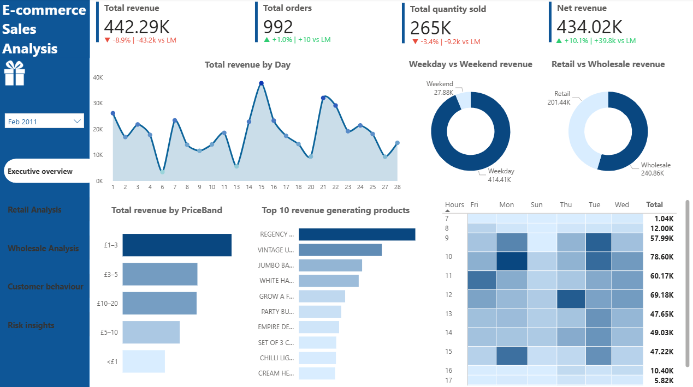
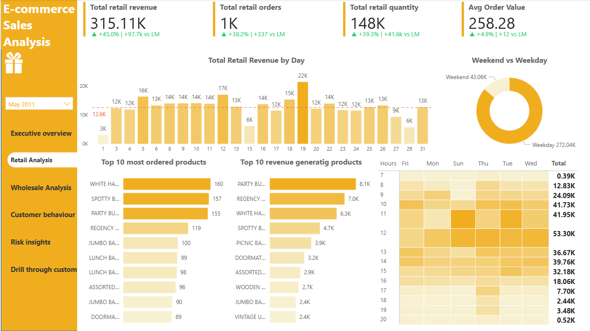
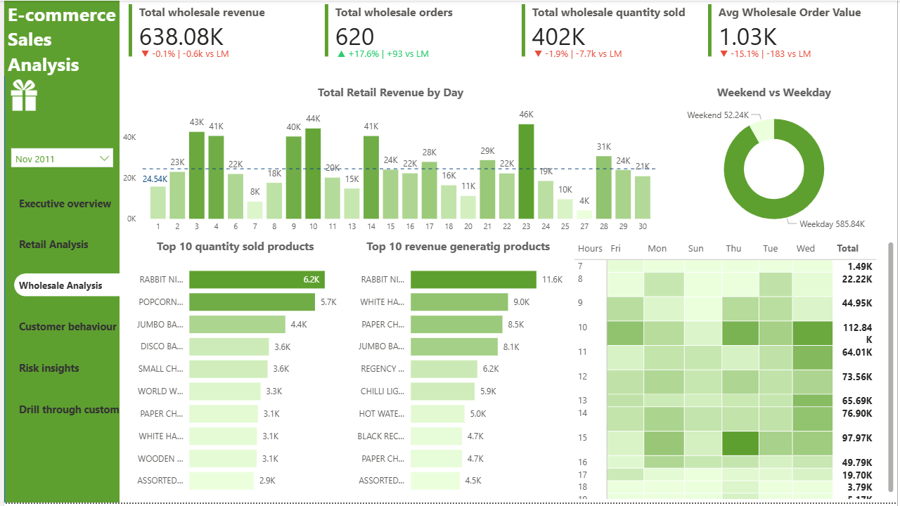
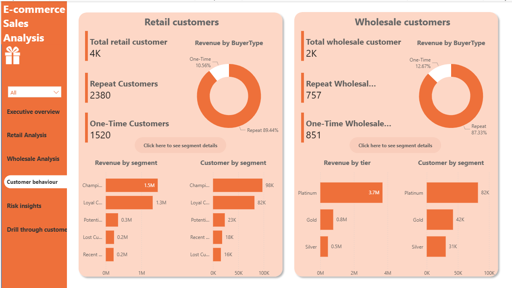
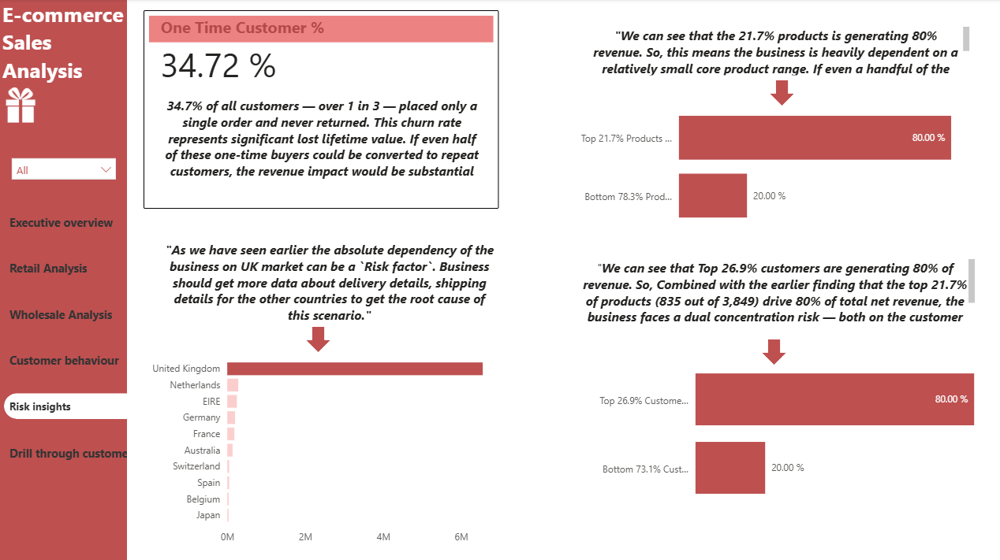

---

# 🛒 E-Commerce Sales Analysis

A comprehensive end-to-end data analysis project on a UK-based online retail dataset (Dec 2010 – Dec 2011), covering data cleaning, exploratory data analysis, customer segmentation, risk insights and an interactive Power BI dashboard.

---
        

## 📊 Dataset

- **Source:** [UCI Machine Learning Repository – Online Retail Dataset](https://archive.ics.uci.edu/ml/datasets/Online+Retail)
- **Period:** December 2010 – December 2011
- **Description:** Transactional data from a UK-based non-store online retail company selling gift-ware. Customers include both retail and wholesale business buyers.

---

## 🔧 Tools & Technologies

| Tool | Purpose |
|------|---------|
| Microsoft Excel | Initial data cleaning & formatting |
| Python (Pandas, Matplotlib, Seaborn) | EDA, feature engineering, segmentation |
| Jupyter Notebook | Analysis environment |
| Power BI | Interactive dashboard & visualization |

---

## 🔍 Key Analysis Areas

1. **Data Cleaning & Pre-processing** — Handling nulls, duplicates, cancellations etc
2. **Feature Engineering** — Revenue, price bands, buyer type classification etc
3. **Exploratory Data Analysis** — Time-series trends, hourly/daily patterns
4. **Retail vs Wholesale Analysis** — Segmented revenue & order breakdown
5. **RFM Customer Segmentation** — Champions, Loyal, At-Risk, Lost customers
6. **Risk Analysis** — Pareto analysis on products and customers

---

## 📈 Dashboard Preview

### Executive Overview

### Retail Analysis

### Wholesale Analysis

### Customer Behaviour

### Risk Insights

---

## 💡 Key Business Insights

- **Wholesale dominates revenue** but retail shows higher growth momentum
- **Peak revenue hours** are 10–12 PM on weekdays, especially Thursdays
- **34.72% one-time customer churn** represents significant lost lifetime value
- **Top 21.7% of products drive 80% of revenue** — heavy core product dependency
- **Top 26.9% of customers generate 80% of net revenue** — dual concentration risk
- **UK market dominance** is flagged as a geographic dependency risk

---

## 👤 Author

**Kaushik Saha**
An Aspiring Data Analyst

---

## 📄 License

This project uses publicly available data from the UCI Machine Learning Repository. All analysis and dashboard work is original.

